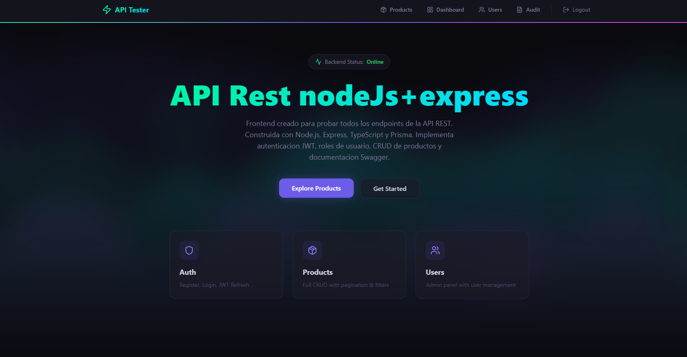
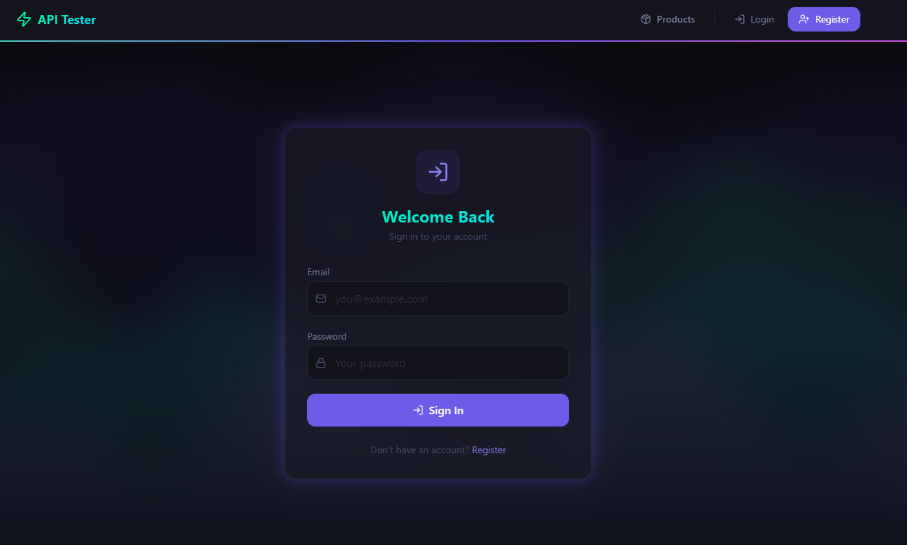
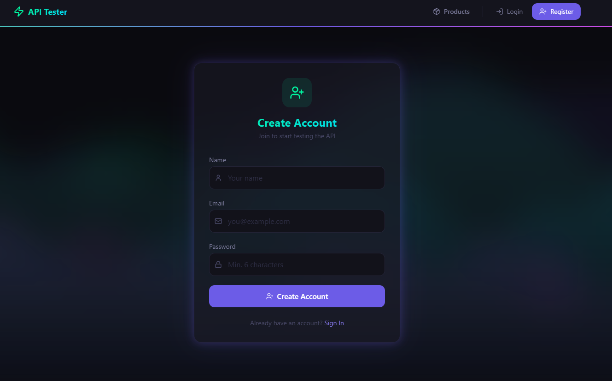
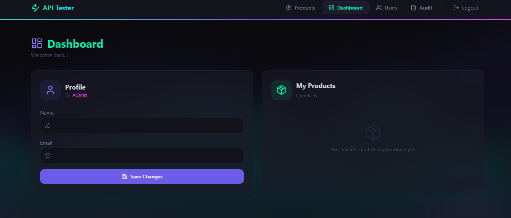
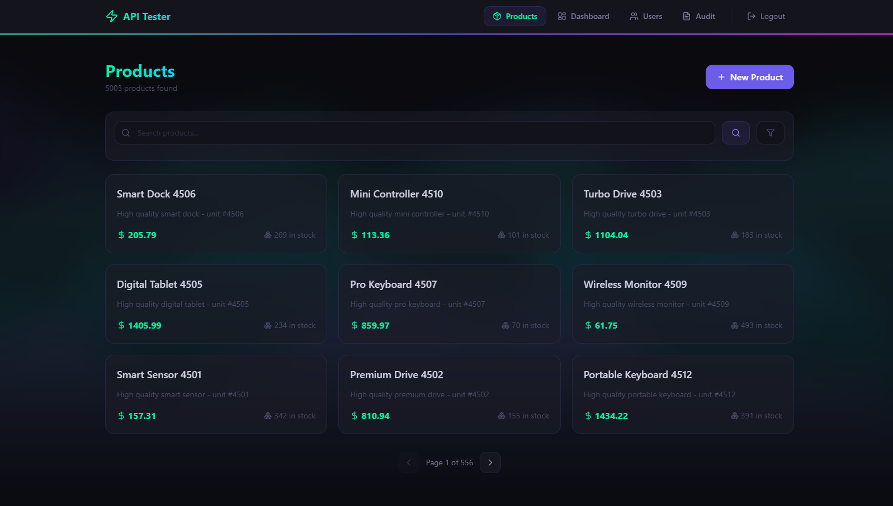
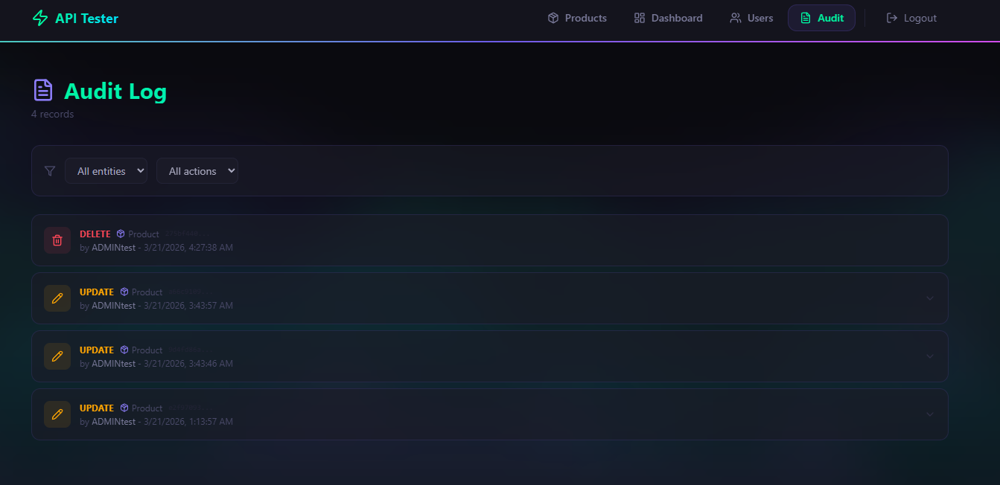

# Node API REST Fullstack
## 

## Resumen del Proyecto
Plataforma fullstack que implementa una API REST escalable con arquitectura en capas. Incluye autenticación basada en JWT, autorización por roles, gestión completa de usuarios y productos, documentación interactiva con Swagger, testing automatizado (unitario e integración) y pruebas de carga.
El frontend consume todos los endpoints mediante una interfaz moderna con tema oscuro, animaciones fluidas y manejo de estados eficiente.

## ¿Porque este proyecto?

Construí esta API para tener una implementación de referencia que cubra los patrones que uso en producción: auth JWT con refresh tokens, autorización por roles, audit trail con historial de cambios, validación con Zod, testing a tres niveles (unit, integration, stress), y CI/CD.

El frontend existe para probar cada endpoint visualmente, no como producto final.

Lo que me interesaba practicar y demostrar:

Arquitectura layered con separation of concerns real (no todo en el controller)
Audit/traceability — quién hizo qué, cuándo, con diff de cambios
Testing que va más allá de "happy path": permisos, roles, edge cases, carga
Un stress test con k6 que pasa umbrales reales (p95 < 200ms, >500 req/s)
---

### Vision

Construir una API REST con nodeJs y express , acompanada de un frontend interactivo que permita probar todos los endpoints en tiempo real.

### Objetivos

1. Implementar autenticacion JWT con access/refresh tokens y roles (ADMIN, USER)
2. CRUD completo de productos con paginacion, filtrado y ordenamiento
3. Gestion de usuarios con autorizacion basada en roles
4. Sistema de auditoria y trazabilidad (quien creo/actualizo/elimino, cuando, historial de cambios)
5. Documentacion automatica con Swagger/OpenAPI
6. Testing: unitario, integracion y estres (k6)
7. Frontend moderno con Next.js para probar toda la API visualmente
8. Entorno reproducible con Docker

### Modulos

| Modulo | Backend | Frontend | Estado |
|--------|---------|----------|--------|
| Autenticacion (Register/Login/Refresh) | Implementado | Implementado | Completo |
| Productos (CRUD + filtros + paginacion) | Implementado | Implementado | Completo |
| Usuarios (CRUD + roles) | Implementado | Implementado | Completo |
| Auditoria y trazabilidad | Implementado | Implementado | Completo |
| Documentacion Swagger | Implementado | N/A | Completo |
| Rate Limiting | Implementado | N/A | Completo |
| Tests unitarios | Implementado | Implementado | Completo |
| Tests de componentes | N/A | Implementado | Completo |
| Tests de integracion | Implementado | Pendiente | Backend completo |
| Test de estres (k6) | Implementado | N/A | Completo |
| CI/CD (GitHub Actions) | Implementado | Pendiente | Backend completo |

---

## Demo

| Servicio | URL |
|----------|-----|
| Frontend | https://frontend-delta-wine-78.vercel.app |
| Backend API | https://optimistic-caring-production.up.railway.app/api |
| Swagger Docs | https://optimistic-caring-production.up.railway.app/api/docs |
| Health Check | https://optimistic-caring-production.up.railway.app/api/health |

---

## Credenciales de prueba

| Rol | Email | Password |
|-----|-------|----------|
| ADMIN | admin@example.com | admin123 |
| USER | user@example.com | user123 |

> El rol **ADMIN** da acceso a la gestión de usuarios y al audit log completo.

---

## Stack Tecnologico

### Backend

| Tecnologia | Uso |
|-----------|-----|
| Node.js 20 LTS | Runtime |
| Express 5.x | Framework HTTP |
| TypeScript 5.x (strict) | Lenguaje |
| Prisma 5.x | ORM type-safe |
| PostgreSQL 16 | Base de datos |
| Zod | Validacion de datos |
| JWT (jsonwebtoken) | Autenticacion |
| bcrypt | Hash de passwords |
| express-rate-limit | Rate limiting (global + auth) |
| Helmet 8.x | Headers de seguridad HTTP |
| compression | Compresion gzip de respuestas |
| Swagger (swagger-jsdoc) | Documentacion API |
| Vitest + Supertest | Testing |
| k6 | Test de estres |
| Docker + Compose | Contenedores |
| GitHub Actions | CI/CD |
| ESLint + Prettier | Linting y formato |

### Frontend

| Tecnologia | Uso |
|-----------|-----|
| Next.js 15 (App Router) | Framework React |
| React 19 | UI Library |
| TypeScript 5.x (strict) | Lenguaje |
| Tailwind CSS 4 | Estilos utility-first |
| Framer Motion 12 | Animaciones fluidas |
| Lucide React | Iconos |
| Vitest + React Testing Library | Testing unitario y de componentes |
| MSW (Mock Service Worker) | Mock de API en tests |

---

## Estructura del Proyecto

```
node-apirest-fullstack/
├── backend/                 # API REST
│   ├── src/
│   │   ├── config/          # Variables de entorno (Zod)
│   │   ├── database/        # Prisma client singleton
│   │   ├── modules/
│   │   │   ├── auth/        # Register, Login, Refresh
│   │   │   ├── user/        # CRUD usuarios
│   │   │   ├── product/     # CRUD productos
│   │   │   └── audit/       # Auditoria y trazabilidad
│   │   └── shared/          # Middlewares, utils, types
│   ├── prisma/              # Schema, migraciones, seeds
│   ├── tests/               # Unit, integration, stress
│   ├── Dockerfile
│   └── docker-compose.yml
│
├── frontend/                # Cliente Next.js
│   └── src/
│       ├── app/             # Pages (App Router)
│       ├── components/      # UI components animados
│       ├── context/         # Auth context (JWT)
│       └── lib/             # API client, types, transitions
│
└── README.md
```

---

## Screenshots

### Home


### Autenticacion

| Login | Register |
|-------|----------|
|  |  |

### Dashboard


### Products


### Audit Log


---

## Inicio Rapido

### Requisitos

- Node.js >= 20
- Docker y Docker Compose
- npm >= 9

### Instalacion

```bash
# Clonar
git clone https://github.com/codeleinermj/node-apirest-fullstack.git
cd node-apirest-fullstack

# Backend
cd backend
npm install
cp .env.example .env          # Editar con tus valores
docker compose up -d db       # Levantar PostgreSQL
npm run prisma:migrate        # Crear tablas
npm run prisma:generate       # Generar cliente Prisma
npm run prisma:seed           # Datos iniciales (opcional)
npm run dev                   # http://localhost:3000

# Frontend (en otra terminal)
cd frontend
npm install
npm run dev                   # http://localhost:3001
```

---

## Licencia

ISC
